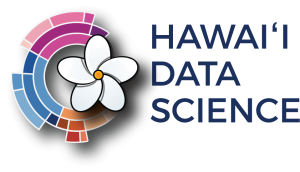

  

      

## Welcome

This Github Organization is to collaborate, share, and ensure the reproducibility of the data science practiced by the NSF INCLUDES Alliance: Alliance Supporting Pacific Impact through Computational Excellence (ALL-SPICE) (Award Number 2217242)

### All-SPICE Alliance Vision Statement

*Harness the data revolution* in support of sustainability, prosperity, and social justice in the Hawaii-Pacific region, placing *Pacific data in Pacific hands*.

### You can expect 

  - Clean, well-documented code
  - Contact information for project participants
  - Actionable, value-driven data science

 

#### Activity 1.3 Undergraduate Research Experiences (URE) Spring 2024
- [Maunalua Fishpond Heritage Center Dashboard & Analysis](https://github.com/NSF-ALL-SPICE-Alliance/MFHC)
- [Collaboration on SDGsR | An R package for interacting with the UN Sustainable Development Goals API](https://github.com/DrMattG/SDGsR)
- [Aid Disbursement & Effectiveness in Small Island Developing States (SIDS)](https://github.com/NSF-ALL-SPICE-Alliance/CIFAL-Honolulu-ROI-SIDS)
- [Comparison of Outcomes by Service Setting for Substance Abuse Treatment in Hawaii](https://github.com/NSF-ALL-SPICE-Alliance/CDC-Treatment-ML)
- [National Mental Health Services Survey](https://github.com/kbenozat/MH-NHSS)

#### Activity 2.3 SPICE Summer Data Science Institute (Summer 2024)
- Pacific Innovation Intelligence Initiative (P3I) Funded Projects
  - [Detecting & Mapping Ocean Plastics with ML and Sentinel2](https://github.com/NSF-ALL-SPICE-Alliance/marine-debris-ML)
  - [Utilizing Machine Learning in Forest Mapping](https://github.com/NSF-ALL-SPICE-Alliance/forest-mapping)
  - [Exploring NASA Harvest Cropland Data & Models in Improving Cropland Map Accuracy for Hawaii](https://github.com/NSF-ALL-SPICE-Alliance/cropland-mapping)
  - [Interactive Mapping in R of the 2022 National Directory Of Mental Health Treatment Facilities](https://github.com/NSF-ALL-SPICE-Alliance/geo-facility-ml?tab=readme-ov-file)
  - [Forecasting Wave Heights using ARIMA](https://github.com/NSF-ALL-SPICE-Alliance/arima-wave) 

#### Activity 2.3 SPICE Summer Data Science Institute (Summer 2023)
- Pacific Innovation Intelligence Initiative (P3I) Funded Projects
  - [Climate Natural Language Processing (NLP)](https://github.com/NSF-ALL-SPICE-Alliance/SPICE-P3I-Climate-Health-NLP)
  - [Resillience in Small Island Developing States (SIDS)](https://github.com/NSF-ALL-SPICE-Alliance/SPICE-P3I-SIDS-Resillience)

